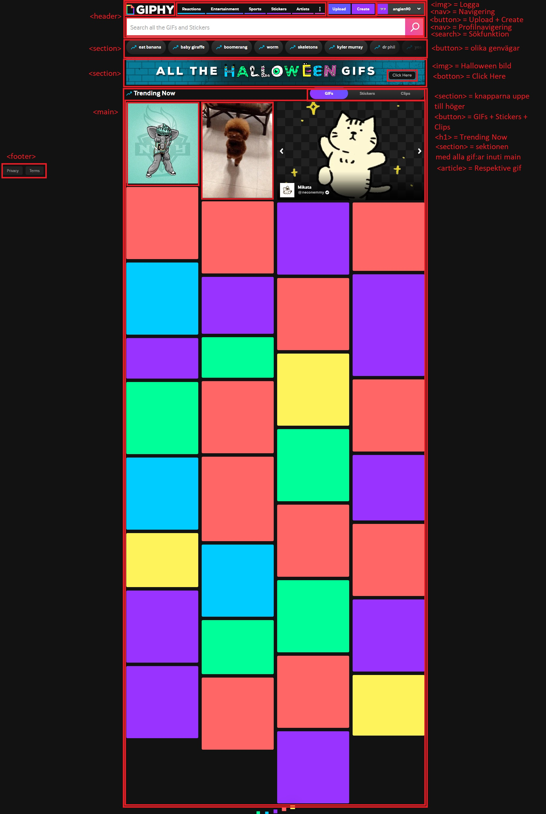
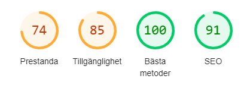

# ⚡️ Hemtenta

## 📝 Instruktioner
- Hemtentan lämnas in senast vid den tidpunkten som finns angiven på itslearning och/eller i inlämningsuppgiften. Inskickade svar via Teams, itslearning eller motsvarande accepteras inte.

- Skriv svaren direkt i denna markdown-fil, och committa.

- Om du använder VS Code så kan du förhandsgranska Markdown-filen med hjälp av denna ikon: 

Frågorna är strukturerade enligt följande format i dokumentet, och du skriver ditt svar genom att inleda med en s.k. "krokodilkäft", se nedan:

---
### Frågans titel
1. attribut
> mitt svar skriver jag här
---

- Betrakta även tentatillfället som en möjlighet att _lära sig något_, och inte enbart som en kunskapskontroll. Glöm alla principer från tidigare skolgång om examination; det går inte att applicera på kod (tycker jag).
- På samtliga frågor, svara _med egna ord_. Jag vill inte ha inklistrade svar från Wikipedia eller motsvarande.
- Om någon beskrivning/fråga är oklar - skriv hur du har tolkat den! Det löser sig 🚑️
- För G krävs 60 % godkända svar och för VG 80 %.
- Du kan öppna denna fil i t.ex. Visual Studio Code, och bör då få upp en förhandsgranskning om du upplever det textbaserade filformatet besvärligt att läsa :)
- 💥 Läs igenom _alla_ frågorna innan du sätter igång med att svara, så vet du vilka som kommer att ta längre tid, och vilka som tar kortare tid.

## 🧑‍💻 Frågor

### 1. Semantik
- Vad innebär "semantik" som begrepp?
> När vi använder semantiska HTML-element, som < header >, < nav >, < article > och < footer >, ger vi dessa element en specifik mening och betydelse.

- Varför ska det användas?
> Med ett semantiskt HTML-element säger vi till viss del hur något ska se ut men vi beskriver också vad elementet är och vilken roll det spelar på sidan. Vi får även med vissa andra funtkioner som hjälper till med t.ex. tillgänglighetsanpassning.  

- Ge ett exempel vardera på hur semantik påverkar (1) tillgänglighet, (2) SEO och (3) kodgranskning/samarbete.
> <b>Tillgänglighet</b>: Personer som använder skärmläsare för att navigera på webben kan lättare förstå strukturen och innehållet på webbplatsen. Genom att använda semantiska element kan skärmläsaren ge en mer korrekt och meningsfull beskrivning av sidan. Även andra hjälpmedel, som taligenkänning och braille-displayer, drar nytta av semantisk HTML. 
> <b>SEO</b>: Sökmotorer som Google använder algoritmer för att förstå innehållet på en webbsida. Semantisk HTML hjälper sökmotorerna att bättre förstå strukturen och betydelsen av innehållet, vilket kan förbättra webbplatsens rankning i sökresultaten. 
> <b>Kodgranskning/samarbete</b>: Semantisk HTML skapar en tydlig struktur och gör koden mer läsbar och lättare att förstå. Detta i sin tur underlättar vid framtida ändringar och underhåll både av en själv men också av andra utvecklare.

### 2. Semantik
Välj ut en valfri sajt som _inte_ är en tidningssida eller någonting som du själv har gjort. Ta en skärmdump på den primära delen av sidan (= det som syns på din skärm när du surfar in på sidan). Beskriv hur du hade strukturerat upp den i block och vilka semantiska taggar du hade använt. Du kan t.ex. använda rutor med siffror för att koppla ihop dina förklaringar.

Se referensbild nedan.

> Jag valde siten [giphy.com](https://giphy.com/) ;P I referensbilden kan du se de semantiska element jag hade använt på denna sajt. 

### 3. Terminologi 1
Beskriv med egna ord vad följande saker är:

1. attribut
> Ett attribut är som en extra egenskap som man kan ge till ett HTML-element. Det ger mer information om elementet och påverkar ofta hur det visas eller beter sig på webbsidan. Attribut skrivs inuti starttaggen för ett element, och de har alltid ett namn och ett värde.
 
> <i>Exempel på attribut: class, style, href, src och alt</i>.

2. pseudo selector
> En pseudo selector är ett speciellt ord eller uttryck som man lägger till i en CSS-selector för att styla ett element baserat på dess tillstånd eller position i dokumentet, utan att behöva ändra själva HTML-koden. Med hjälp av pseudo-selectorer kan man säga "styla den första paragrafen", "styla en länk när musen svävar över den" eller "styla ett element när det är i fokus".
 
> <i>Exempel på pseudo selector: a:hover, a:visited, a:link, p:first-child och input:focus</i>. 

3. parent i DOM
> DOM kan liknas med ett familjeträd där varje element i DOM-trädet är en individ i familjeträdet. 
 
> Parent/föräldern till ett element/en individ är det element/den individen som kommer direkt ovanför i trädet.

4. sibling (i DOM)
> Likt DOM beskrivningen ovan så kan ett element ha två eller flera element som delar samma förälder, dessa kallas för siblings/syskon. 

5. child (i DOM)
> Ett element som finns direkt inuti ett annat element kallas för ett barn till det överordnade elementet.

6. child och sibling selectors i CSS
> Child och sibling selectors i CSS låter dig välja specifika element baserat på deras relation till andra element i DOM-trädet. Genom att förstå dessa selektorer kan man skapa mer precisa och målinriktade stilregler.
 
> <b>Child-selektor</b> används för att välja element som är direkta barn till ett annat element. 
> <b>Sibling-selektorer</b>: Används för att välja element som är syskon till ett annat element. Det finns två typer av sibling-selektorer: 
> <b>Adjacent sibling selector</b>: Väljer det första syskonet som kommer direkt efter ett annat element.  <b>General sibling selector</b> som väljer alla syskon som kommer efter ett annat element.

7. URL
> URL står för Uniform Resource Locator och är adressen till en webbsida. Varje sida på nätet har en unik URL. 
 
> En typisk URL består av flera delar:  
> <b>Protokoll</b>: Vanligtvis "http://" eller "https://", vilket anger vilken typ av anslutning som används.  
> <b>Domännamn</b>: Namnet på webbplatsen, t.ex. "[ogiltig webbadress har tagits bort]". 
> <b>Sökväg</b>: Den specifika platsen för sidan inom webbplatsen, t.ex. "/search".  
> <b>Parametrar</b>: Ibland finns det ytterligare information efter ett frågetecken, t.ex. "?q=sökordet".

8. domän
> En domän är som en adress på internet. En domän består av ett domännamn som ofta är baserade på ord eller fraser som är lätta att associera med webbplatsens innehåll t.ex. Google, och är det man skriver in i adressfältet. En domän består även av en toppdomän som hjälper till att organisera internet genom att gruppera webbplatser baserat på deras ämne eller syfte (t.ex. .com för kommersiella webbplatser, .org för organisationer)

9. DNS
> DNS står för Domain Name System. När man skriver in en webbadress i sin webbläsare t.ex. google.com, skickar den en förfrågan till en DNS-server. DNS-servern söker i sin databas efter den motsvarande IP-adressen för det angivna domännamnet. När IP-adressen hittas skickar DNS-servern tillbaka den till webbläsaren. Webbläsaren använder sedan IP-adressen för att ansluta till den specifika servern där webbplatsen finns lagrad.

10. a11y
> A11y är en förkortning för accessibility. På svenska heter motsvarande t12t som är en förkortning för tillgänglighet. Detta är ett begrepp som används för att beskriva hur lätt det är för alla användare, oavsett funktionsförmåga, att använda en webbplats eller applikation. A11y är i många fall ett lagkrav. Exakt vilka lagar som gäller beror på vilket land och vilken typ av organisation man har. 

### 4. Tillgänglighet
Gör en övergripande tillgänglighetsanalys på "Kundprojektet" (inlämningsuppgift 2). Beskriv 5 saker som kan förbättras i antingen design, eller i koden, utifrån tillgänglighetsperspektiv.
> Här ser man en printbild på min tillgänglighetsanalys.   
> 1. Texten "You should accept cookies" har för dålig kontrast. Antingen bör textfärg eller bakgrundsfärg ändras.  
> 2. Input fälten i formuläret för att beställa ett bord behöver ha etiketter som tydliggör vad som förväntas att man fyller i.  
> 3. Se över så att tabb-ordningen är korrekt.  
> 4. Kontrollera så att man använder rätt semantiska taggar och får på så sätt med sig annan funktionalitet.  
> 5. Kontrollera att man inte har display:none någonstans i sin kod utan isåfall att man använder .visually-hidden.

### 5. Optimering
Beskriv syftet med följande (dvs. varför det görs):

- Komprimera (minifiera) Sass-kod
> Att komprimera eller minifiera Sass-kod är en viktig del av att optimera en webbplats för snabb laddningstid. När man komprimerar Sass-kod så minskar man filstorleken, vilket leder till flera fördelar.  
<b>Snabbare laddningstid</b>: Mindre filer tar mindre tid att ladda ner, vilket ger en bättre användarupplevelse för besökarna. 
<b>Minskad bandbredd</b>: Mindre filer kräver mindre bandbredd, vilket är bra både för utvecklaren, företaget man arbetar för och för besökarna. 
<b>Ökad prestanda</b>: Snabbare laddningstider leder till bättre prestanda för webbplatsen. 
<b>Bättre SEO</b>: Sökmotorer gynnar webbplatser med snabb laddningstid.

- Använda resurser från externa (CDN-)källor, t.ex. Google Fonts, istället för att ladda ner typsnitt.
> Att använda externa resurser som Google Fonts istället för att ladda ner typsnitt direkt till  webbplatsen har flera fördelar.  
<b>Prestandaökning</b>: Då Google Fonts levereras från ett globalt Content Delivery Network (CDN). Detta innebär att om en användare tidigare har besökt en annan webbplats som använder samma Google Font, så finns fontfilerna förmodligen redan lagrade i användarens <i>cacheminne</i>. Detta resulterar i snabbare laddningstider. Google har även <i>optimerat sina fontfiler</i> för snabb laddning och minimal bandbredd. 
<b>Enklare hantering</b>: När Google släpper <i>uppdateringar</i> av sina typsnitt så uppdateras dessa automatiskt på alla webbplatser som använder dem. Man behöver inte manuellt ladda ner och uppdatera sina fontfiler. Genom att låta Google hantera lagringen och leveransen av fontfilerna <i>minskar belastningen på den egen servern</i>. 
<b>Stort utbud</b>: Google Fonts erbjuder ett <i>brett utbud</i> av högkvalitativa, kostnadsfria typsnitt. Det är också <i>enkelt att integrera</i> Google Fonts i webbplatsen genom att lägga till en enkel < link > tagg i ditt HTML-dokument. 
<b>Tillgänglighet</b>: Google Fonts är <i>tillgängligt över hela världen</i>, vilket säkerställer att användaren kan se typsnitten oavsett var de befinner sig. 
<b>SEO</b>: <i>Snabbare laddningstider</i> är en viktig faktor för SEO. Genom att använda Google Fonts kan man förbättra webbplatsens rankning i sökmotorerna.

- Lighthouse
> Lighthouse är ett ovärderligt verktyg för alla som vill skapa högkvalitativa webbplatser. Med hjälp av Lighthouse kan man: 
> <b>Öka webbplatsens hastighet</b>: Snabbare laddningstider leder till bättre användarupplevelse och högre placeringar i sökmotorerna. 
<b>Förbättra tillgängligheten</b>: Genom att göra webbplatsen mer tillgänglig når man en större publik och följer legala krav. 
<b>Förbättra SEO</b>: En väl optimerad webbplats har större chans att rankas högre i sökmotorerna. 
<b>Förebygga problem</b>: Lighthouse hjälper till att identifiera potentiella problem innan de blir större. 
<b>Ta bättre beslut</b>: De detaljerade rapporterna från Lighthouse ger ett underlag för att fatta välgrundade beslut om hur man ska förbättra sin webbplats.

### 6. Bilder
Förklara följande:

1. Varför används attributet `loading="lazy"` i HTML på vissa bilder? 
> Används för att optimera laddningen av bilder på en webbsida. Det är ett sätt att förbättra sidans prestanda genom att skjuta upp laddningen av bilder som inte är synliga för användaren när sidan först laddas. När användaren scrollar ner på sidan kommer bilderna som nu är synliga att laddas automatiskt. Denna metod ger både en snabbare sidladdning, minskar bandbredd och förbättrar batteritiden på enheten då mindre data behöver laddas ner. loading="lazy används för bilder som inte är kritiska för sidans första intryck och för stora bilder. Viktigt att komma ihåg är att Javascript måste vara aktivirat i webbläsaren för att det ska fungera samt att alla webbläsare inte stöder loading="lazy. Man ska även använda loading="lazy med försiktighet då det inte är lämpligt för alla typer av bilder.

2. Vad gör motsvarande attribut `loading="eager"` i HTML? 
> Attributen loading="eager" är motsatsen till loading="lazy" och används för att prioritera laddningen av en bild. När man använder loading="eager" på en bildinnehållselement, instruerar man webbläsaren att ladda bilden så fort som möjligt, oavsett om den är synlig eller inte. Detta betyder att bilden kommer att laddas parallellt med andra resurser på sidan, vilket kan påverka sidans initiala laddningstid.

3. Utöver tillgänglighetsaspekten, varför bör du sätta ett `alt`-attribut på bilder? 
> <b>SEO</b>: Sökmotorer som Google använder alt-texten för att indexera bilder och förstå deras innehåll. En välformulerad alt-text kan hjälpa webbplatsen att rankas högre i sökresultaten för relevanta sökord. 
<b>Sociala medier</b>: När en bild delas på sociala medier används ofta alt-texten som bildbeskrivning. En bra alt-text kan därför öka engagemanget och spridningen av ditt innehåll. 
<b>Marknadsföring</b>: Alt-texten kan användas för att förstärka budskapet och marknadsföra  produkterna eller tjänsterna. 
<b>Säkerhetskopiering</b>: Om en bild inte kan laddas, kommer alt-texten att visas istället. Detta säkerställer att användaren fortfarande får en viss information om vad bilden föreställer.

4. Att sätta `width` och `height` som attribut i HTML-koden på bilder, vad bidrar det till?
> <b>Snabbare sidladdning</b>: När webbläsaren känner till bildens dimensioner i förväg kan den reservera rätt utrymme på sidan och undvika att behöva reflow-a (omformatera) sidan när bilden laddas. Detta bidrar till en snabbare upplevelse för användaren. 
<b>Bättre layout</b>: Genom att specificera bildens dimensioner kan man lättare kontrollera hur bilden ska placeras på sidan och undvika oönskade layoutförskjutningar när bilden laddas. 
<b>Tillgänglighet</b>: För personer som använder skärmläsare kan det vara till hjälp att veta bildens dimensioner för att förstå dess relativa storlek och betydelse på sidan. 
<b>SEO</b>: Även om det inte är en direkt rankingfaktor kan dimensionerna hjälpa sökmotorer att bättre förstå bildens innehåll och kontext.

### 7. Ramverk
Lista:

1. Två stycken kända CSS-ramverk/-bibliotek/-"helpers"
> <b>Bootstrap</b>: Är ett av de mest populära och väl etablerade CSS-ramverken. 
<b>Tailwind CSS</b>: Är ett utility-first CSS-ramverk som ger en samling låg-nivå CSS-klasser som kan kombinera för att skapa anpassade designs.

2. Ett känt HTML-template som man kan starta sina projekt utifrån
> HTML5 Boilerplate. 

3. Nämn en bra sajt där du kan hålla koll på CSS-trender
> På https://css-tricks.com/ kan man skriva upp sig på deras nyhetsbrev och på så sätt håller sig uppdaterad. 

### 8. Sass
Förklara följande koncept:

1. mixin
> En mixin är som en mall eller en modul inom CSS som låter en gruppera flera deklarationer (dvs. egenskaper och värden) och sedan inkludera den gruppen på flera olika ställen i sin stylesheet. Det är ett kraftfullt verktyg för att organisera sin kod, undvika upprepningar och göra sin CSS mer modulär. Man kan likna det med ett recept där man skapar ett recept för "röd text med fet stil" och sedan använda det receptet i flera olika rätter (element) i sin meny (stylesheet).

2. lists
> En Sass-lista är, precis som det låter, en lista med värden. Dessa värden kan vara allt från färger, typsnitt, mått eller textsträngar. Listor är ett oerhört användbart verktyg i Sass eftersom de låter en organisera och manipulera data på ett effektivt sätt.

3. function
> Function är ett återanvändbart stycke kod som utför en specifik uppgift. Det kan vara att beräkna en färg, skapa en skugga eller generera en unik klassnamn. Genom att förstå hur funktioner fungerar och hur de kan användas kan man skriva mer effektiv och elegant kod.

4. partials
> En partial i Sass är en Scss-fil som börjar med ett understreck (_), till exempel _variables.scss. Dessa filer är avsedda att importeras till andra Scss-filer och fungerar som byggstenar för sin övergripande stylesheet. De kompileras inte till egen CSS-fil utan används för att organisera och strukturera sin kod.

5. variables
> Variabler i Sass tillåter en att lagra värden, som färger, teckensnitt eller andra CSS-egenskaper, på ett ställe och sedan återanvända dessa värden över hela stylesheeten. Detta gör koden mer läsbar, lättare att underhålla och mindre benägen för fel.

### 9. Tillgänglighet
Besvara följande frågor:

1. När ska du använda ARIA labels?
> ARIA labels används för att förbättra tillgängligheten på webbplatser, särskilt för personer som använder skärmläsare. De ger extra information om ett elements syfte, funktion eller innehåll som inte är tydligt från elementets HTML-tagg eller dess textinnehåll.

2. Vad är den minsta rekommenderade storleken på ett interaktivt element, t.ex. en knapp, på en liten skärm (t.ex. mobil)?
> Det finns ingen exakt bestämmelse för den minsta rekommenderade knappstorleken, men 44x44 pixlar är en bra utgångspunkt. Det viktigaste är att skapa en användarupplevelse som är både intuitiv och tillgänglig för alla användare. För att skapa en användarvänlig och tillgänglig webbplats behöver man ta vara på de verktyg som finns för att simulera användarupplevelsen.

3. Vad är den minsta rekommenderade font-storleken i pixlar?
> Det finns ingen exakt minsta font-storlek som passar alla situationer. Det bästa är att utgå från den generella riktlinjen (16px) och använda verktyg för att simulera användarupplevelsen.

4. Varför ska du använda t.ex. rem eller em som enhet på fonter istället för pixlar?
> Genom att använda rem eller em istället för pixlar får man en mer flexibel, tillgänglig och underhållbar webbplats. Dessa enheter gör det möjligt att skapa en skräddarsydd typografi som anpassar sig efter olika användare och enheter.  
<b>rem</b>: Används ofta för att sätta font-size på body och andra element som ska skalas i förhållande till den övergripande textstorleken på webbplatsen. 
<b>em</b>: Relaterar till font-size på det överordnade elementet. Detta kan vara användbart för att skapa hierarkier i textstorlekar, men kan göra det lite svårare att få överblick över hela typografin.

5. Vilken tillgänglighetsnivå (A) ska du eftersträva minst för publika sidor, t.ex. myndighetssidor?
> För publika sidor, särskilt myndighetssidor, bör man eftersträva att uppfylla tillgänglighetsnivån AAA enligt WCAG (Web Content Accessibility Guidelines). Vanliga siter ska uppfylla minst AA. 

6. Vilken myndighet i Sverige ansvarar för tillgänglighet?
> Myndigheten för digital förvaltning (DIGG) har huvudansvaret för tillsyn och uppföljning av lagen om tillgänglighet till digital offentlig service i Sverige. Det innebär att de övervakar att offentliga aktörer, som exempelvis myndigheter och kommuner, uppfyller kraven på tillgänglighet på sina webbplatser och mobila applikationer.

7. Du skapar en knapp med hjälp av ett div-element. Beskriv problematiken i detta.
> Att använda ett div-element kan leda till flera problem, både vad gäller tillgänglighet och användarupplevelse. Även om det tekniskt sett är möjligt att skapa en knappliknande funktion med ett div-element, är det starkt rekommenderat att använda det semantiska elementet < button > istället. Detta säkerställer en bättre tillgänglighet, användarupplevelse och SEO för webbplatsen.

8. Vem är ansvarig för att tabindex sätts på interaktiva element och att det sker i rätt ordning?
> Ansvaret för att tabindex sätts på interaktiva element och att de placeras i rätt ordning ligger huvudsakligen hos webbutvecklaren. Det är utvecklaren som bestämmer vilka element som ska vara fokuserbara, och i vilken ordning användaren ska kunna navigera mellan dem med tangentbordet.

9. Skriv en alt-text till följande bild, på svenska, engelska eller finska. 
> Språket i alt-texten bör matcha språket på resten av sidan för att ge en konsekvent användarupplevelse. Då vi i detta fallet inte vet vilket språk sidan är på väljer jag engelska.  
 alt="Two ice creams, one of them is melting"  

10. Du har lagt in hysteriska animationer på din sida. Vilken media query använder du för att avaktivera dessa för användare som inte vill ha animationer?
> Även om media query är ett kraftfullt verktyg för responsiv design, är de inte det bästa verktyget för att avaktivera animationer baserat på användarpreferenser. Genom att kombinera JavaScript och CSS kan man ge användaren mer kontroll över innehållet på webbplatsen och skapa en bättre upplevelse för alla.

### 10. Sökmotoroptimering
Blanca Vinorosso har som målsättning att bli Sveriges största influerare och bloggare inom all form av skogskost 🍄 och att ge sina läsare tips på hur man blir, är och hur det är att vara självförsörjande, mediterande skogsmulle.

Du jobbar på webbyrån Undermålig AB som Front End-utvecklare, och chefen har sagt åt dig att fixa fram 5 tips som får Kantarellas sajt att hamna högre upp i sökträffarna.

Kantarellas sajt har precis lanserats, och det finns i dagsläget 5 st blogginlägg och en "Om Kantarella"-sida.

Vilka fem saker gör du?
> 1. <b>Nyckelordsoptimering</b>: Jag hade använt verktyg som Google Keyword Planner eller SEMrush för att hitta populära sökord relaterade till skogskost, självförsörjning och meditation. Sedan hade jag integrerat nyckelorden i sidornas titlar, metabeskrivningar, rubriker, brödtext och bildtexter. Sedan hade jag gruppera relaterade blogginlägg i kluster och länka dem till varandra för att visa sökmotorerna att sajten är en auktoritet inom ämnet. 
> 2. <b>Utökat innehållet</b>: Jag hade sedan bett Blanca publicera nya blogginlägg med högkvalitativt innehåll som svarar på målgruppens frågor. Ju mer innehåll desto mer relevant blir sajten för sökmotorerna.Jag hade även bett Blanca att utöka utbudet med t.ex. guider, recept, videor och podcaster. Varierat innehållet för att locka olika typer av besökare. Vi hade även kunnat skapa en FAQ-sida där vi samlar vanliga frågor och svar om skogskost, självförsörjning och meditation. 
> 3. <b>Optimera bilder</b>: Jag hade sedan gått igenom för att se om vi kan komprimera bilderna. Optimerade bilder laddar snabbare, vilket är viktigt för användarupplevelsen och SEO. Jag hade även sett över filnamnen så att de innehåller relevanta nyckelord (t.ex."kantarell-recept.jpg"). Jag hade även kontrollerat att alla bilder har en alt-text som beskriver bilden och att även dessa innehåller relevanta nyckelord. 
> 4. <b>Öka synligheten</b>: Jag hade sedan bett Blanca att posta gästinlägg på andra relevanta bloggar för att få länkar tillbaka till vår egna sajt. Jag hade även tipsat om att Blanca ska samarbeta med andra andra influencers inom samma nisch för att korsa länkar. Jag hade även sett till att vi skapar delningsvärdigt innehåll så att besökare kan dela sidans innehåll vidare så att vi får nya besökare. 
> 5. <b>SEO</b>: Jag hade även sätt över om vi kan optimera webbplatsens hastighet genom att minimera bildstorlekar, ta bort bilder som inte längre används, minimera HTTP-förfrågningar och använda ett CDN (Content Delivery Network). Jag hade även sätt över så att webbplatsen är responsiv och fungerar bra på alla enheter. Jag hade skapat en XML-sitemap för att hjälpa sökmotorer att indexera alla sidor på webbplatsen. 
 
Utöver dessa 5 steg hade jag även sätt till att vi med jämna mellanrum använd Google Analytics för att spåra trafiken till webbplatsen och se vad som fungerar och vad som kan förbättras. 

