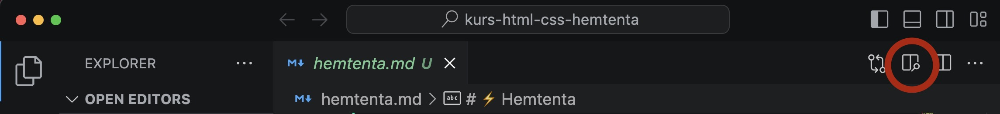
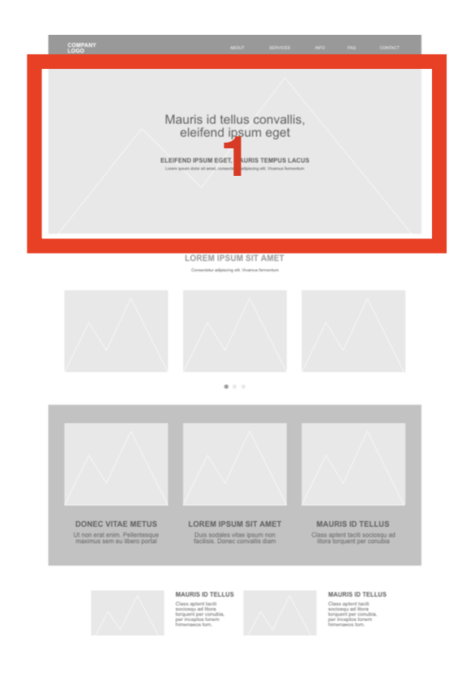

# ⚡️ Hemtenta

## 📝 Instruktioner
- Hemtentan lämnas in senast vid den tidpunkten som finns angiven på itslearning och/eller i inlämningsuppgiften. Inskickade svar via Teams, itslearning eller motsvarande accepteras inte.

- Skriv svaren direkt i denna markdown-fil, och committa.

- Om du använder VS Code så kan du förhandsgranska Markdown-filen med hjälp av denna ikon: 

Frågorna är strukturerade enligt följande format i dokumentet, och du skriver ditt svar genom att inleda med en s.k. "krokodilkäft", se nedan:

---
### Frågans titel
1. attribut
> mitt svar skriver jag här
---

- Betrakta även tentatillfället som en möjlighet att _lära sig något_, och inte enbart som en kunskapskontroll. Glöm alla principer från tidigare skolgång om examination; det går inte att applicera på kod (tycker jag).
- På samtliga frågor, svara _med egna ord_. Jag vill inte ha inklistrade svar från Wikipedia eller motsvarande.
- Om någon beskrivning/fråga är oklar - skriv hur du har tolkat den! Det löser sig 🚑️
- För G krävs 60 % godkända svar och för VG 80 %.
- Du kan öppna denna fil i t.ex. Visual Studio Code, och bör då få upp en förhandsgranskning om du upplever det textbaserade filformatet besvärligt att läsa :)
- 💥 Läs igenom _alla_ frågorna innan du sätter igång med att svara, så vet du vilka som kommer att ta längre tid, och vilka som tar kortare tid.

## 🧑‍💻 Frågor

### 1. Semantik
- Vad innebär "semantik" som begrepp?
- Varför ska det användas?
- Ge ett exempel vardera på hur semantik påverkar (1) tillgänglighet, (2) SEO och (3) kodgranskning/samarbete.

### 2. Semantik
Välj ut en valfri sajt som _inte_ är en tidningssida eller någonting som du själv har gjort. Ta en skärmdump på den primära delen av sidan (= det som syns på din skärm när du surfar in på sidan). Beskriv hur du hade strukturerat upp den i block och vilka semantiska taggar du hade använt. Du kan t.ex. använda rutor med siffror för att koppla ihop dina förklaringar.

Se referensbild nedan.

### 3. Terminologi 1
Beskriv med egna ord vad följande saker är:

1. attribut
2. pseudo selector
3. parent i DOM
4. sibling (i DOM)
5. child (i DOM)
6. child och sibling selectors i CSS
7. URL
8. domän
9. DNS
10. a11y

### 4. Tillgänglighet
Gör en övergripande tillgänglighetsanalys på "Kundprojektet" (inlämningsuppgift 2). Beskriv 5 saker som kan förbättras i antingen design, eller i koden, utifrån tillgänglighetsperspektiv.

### 5. Optimering
Beskriv syftet med följande (dvs. varför det görs):

- Komprimera (minifiera) Sass-kod
- Använda resurser från externa (CDN-)källor, t.ex. Google Fonts, istället för att ladda ner typsnitt.
- Lighthouse

### 6. Bilder
Förklara följande:

1. Varför används attributet `loading="lazy"` i HTML på vissa bilder? 
2. Vad gör motsvarande attribut `loading="eager"` i HTML? 
3. Utöver tillgänglighetsaspekten, varför bör du sätta ett `alt`-attribut på bilder? 
4. Att sätta `width` och `height` som attribut i HTML-koden på bilder, vad bidrar det till?

### 7. Ramverk
Lista:

1. Två stycken kända CSS-ramverk/-bibliotek/-"helpers"
2. Ett känt HTML-template som man kan starta sina projekt utifrån
3. Nämn en bra sajt där du kan hålla koll på CSS-trender

### 8. Sass
Förklara följande koncept:

1. mixin
2. lists
3. function
4. partials
5. variables

### 9. Tillgänglighet
Besvara följande frågor:

1. När ska du använda ARIA labels?
2. Vad är den minsta rekommenderade storleken på ett interaktivt element, t.ex. en knapp, på en liten skärm (t.ex. mobil)?
3. Vad är den minsta rekommenderade font-storleken i pixlar?
4. Varför ska du använda t.ex. rem eller em som enhet på fonter istället för pixlar?
5. Vilken tillgänglighetsnivå (A) ska du eftersträva minst för publika sidor, t.ex. myndighetssidor?
6. Vilken myndighet i Sverige ansvarar för tillgänglighet?
7. Du skapar en knapp med hjälp av ett div-element. Beskriv problematiken i detta.
8. Vem är ansvarig för att tabindex sätts på interaktiva element och att det sker i rätt ordning?
9. Skriv en alt-text till följande bild, på svenska, engelska eller finska. 
10. Du har lagt in hysteriska animationer på din sida. Vilken media query använder du för att avaktivera dessa för användare som inte vill ha animationer?

### 10. Sökmotoroptimering
Blanca Vinorosso har som målsättning att bli Sveriges största influerare och bloggare inom all form av skogskost 🍄 och att ge sina läsare tips på hur man blir, är och hur det är att vara självförsörjande, mediterande skogsmulle.

Du jobbar på webbyrån Undermålig AB som Front End-utvecklare, och chefen har sagt åt dig att fixa fram 5 tips som får Kantarellas sajt att hamna högre upp i sökträffarna.

Kantarellas sajt har precis lanserats, och det finns i dagsläget 5 st blogginlägg och en "Om Kantarella"-sida.

Vilka fem saker gör du?
